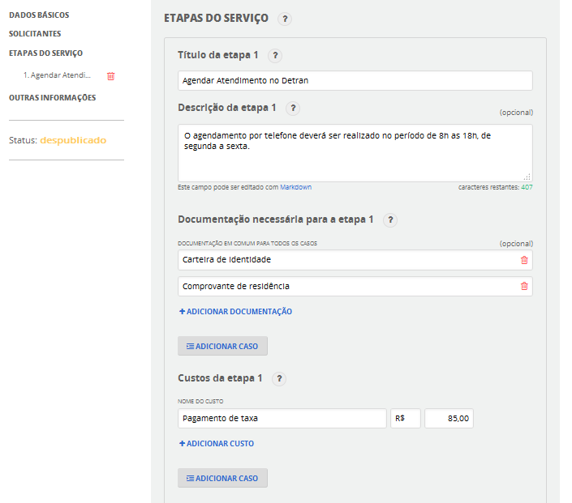

# Etapas do Serviço

O detalhamento da descrição de um Serviço Público consiste na definição das etapas do serviço. Todos os momentos de interação entre a sociedade e o órgão (ou delegatório) devem ser elencados em uma ou mais etapas. 

Cada etapa caracteriza-se pelo canal de interação, custo e documentos requeridos. Em sua descrição deve-se estar atento pois, muitas vezes, ao identificar um serviço, percebe-se que se trata de uma etapa de um outro serviço (ex.: “Agendar Atendimento na Previdência Social” é uma etapa do serviço “Obter auxílio-doença”), pois apenas em conjunto o solicitante alcança de fato um direito ou completa sua jornada de cumprimento de um dever. Neste caso, o órgão deve promover evoluções na Carta de Serviços com vistas a melhor orientar o solicitante.

A identificação de cada etapa do serviço deverá considerar os seguintes critérios:

* Ao final da etapa, o solicitante deverá ter cumprido um requisito necessário para o acesso ao serviço completo e ter uma comprovação de cumprimento dessa etapa (ex.: número de protocolo, confirmação de cadastro, boleto pago, etc);
* Identificar as informações necessárias para caracterizar a etapa: descrição da etapa, documentos necessários, custo, canais de prestação;
* Identificar os casos específicos em que há diferenças na documentação, custos e canais de prestação dentro de cada etapa;
* Deve ser possível identificar o início e final da etapa de forma precisa para o solicitante;
* É possível que haja sequências de etapas diferentes conforme o público (ex.: estudantes de escola pública, menores de idade, aposentados etc) ou conforme alguma condição específica prevista na prestação do serviço (ex.: passaporte de emergência). A descrição deverá ser feita, então, através da criação de um novo serviço. Sugere-se também, nestes casos, a criação de página temática que enquadre os vários serviços relacionados.

**Título da etapa***: escreva um título que indica de forma simples o objetivo dessa etapa. Exemplos:

1. Solicitar a emissão do passaporte;
2. Efetuar o pagamento da GRU;
3. Receber o passaporte.

**Descrição da etapa**: descreva alguma informação complementar relacionada à etapa. Exemplo: o agendamento deverá ser realizado após o 15º dia em que o empregado tiver trabalhado na empresa.

**Documentação necessária para a etapa***: descreva documentos, certidões ou declarações necessárias para essa etapa. Exemplo: Registro Geral (RG), Cadastro de Pessoa Física (CPF), Certidão de Antecedentes Criminais, Certidão de Quitação Eleitoral, Carteira de Trabalho etc.

ATENÇÃO: Há casos em que a documentação muda conforme algumas situações. Assim, é possível adicionar algumas “exceções” na opção “**Adicionar caso**”. Exemplo: para crianças menores de 12 anos, é possível apresentar a certidão de nascimento em substituição ao documento de identidade.

**Custos da etapa**: informe a estimativa mais fiel possível com relação aos custos ou taxas sobre essa etapa. Exemplo: matrícula, R$ 20,00.

ATENÇÃO: Há casos em que o custo muda conforme algumas situações. Assim, é possível adicionar algumas “exceções” na opção “**Adicionar caso**”. Exemplo: para alunos matriculados em instituições públicas de ensino a matrícula é gratuita.

**Canais de prestação da etapa***: informe os canais de prestação disponíveis para realizar essa etapa dentre as opções: aplicativo móvel, e-mail, fax, postal, presencial, SMS, telefone, Web: Acompanhar, Agendar, Calcular taxas, Consultar, Declarar, Emitir, Inscrever-se, Postos de Atendimento, Preencher, Simular.

ATENÇÃO: Há casos em que o canal muda conforme algumas situações. Assim, é possível adicionar algumas “exceções” na opção “**Adicionar caso**”. Exemplo: a emissão de passaporte comum para estrangeiros, em território nacional, será solicitada junto ao Departamento de Polícia Federal e, no exterior, pelas repartições consulares.  

  

Figura 5 – Etapas