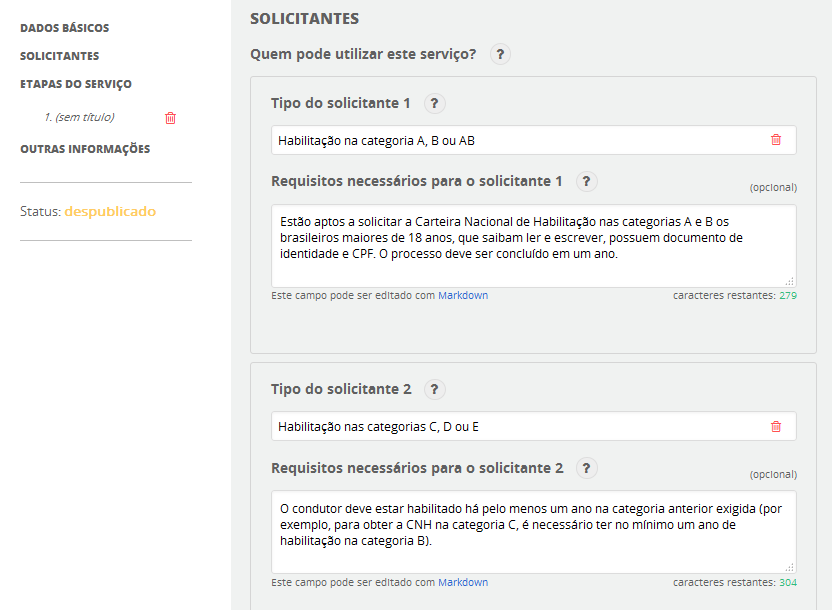

# Solicitantes

**Tipo do solicitante***: descreva quem pode utilizar o serviço. Exemplos: estudante, idoso etc.

**Requisitos necessários para o solicitante**: descreva o que é necessário para o solicitante ser elegível. Exemplos: matriculado em uma instituição de ensino reconhecida pelo MEC, maior de 65 anos etc.  

Figura 4 – Solicitantes